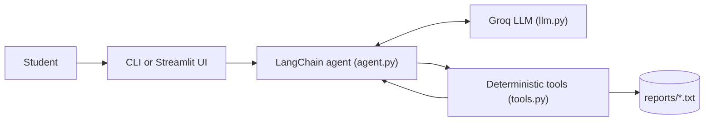

<div align="center">

# 🎓 PUCIT GPA/CGPA Advisor

**A conversational AI agent that calculates your semester GPA, projects your CGPA, and tells you exactly what GPA you need to hit your target.**


</div>

---

## 📖 Overview

Most GPA calculators make you fill in a rigid form. **PUCIT GPA/CGPA Advisor** lets you simply *ask*:

> *"I got 88, 76, 69 and 82 in my courses. What's my GPA?"*
> *"Can I reach a 3.5 CGPA by the end of my degree?"*

It is built as a **tool-calling AI agent**. The language model handles the conversation, but it is **never allowed to do arithmetic itself**. Every number (grade point, GPA, CGPA, credit-hour total) comes from deterministic Python functions, so results are reproducible and not hallucinated.

## ✨ Features

- **Marks → grade points** using the PUCIT grading bands defined in `tools.py`
- **Semester GPA** (credit-hour weighted) from a list of courses
- **CGPA projection** after adding a new semester's result
- **Target CGPA planner**: calculates the GPA you need over the next semester and over all remaining semesters
- **Reachability check**: clearly tells you when a target is impossible instead of returning a misleading number above 4.0
- **Built-in BS(CS) scheme of studies** for all 8 semesters (course codes, names, credit hours)
- **Save reports** of your calculations to a `.txt` file, only when you ask
- **Two interfaces**: terminal chat and a Streamlit web app
- **Input validation** on every tool (marks range, GPA range, credit hours, semester number)

## 🧠 How It Works



1. You send a message through the terminal or the web UI.
2. The agent (LangChain `create_agent`) decides which tool to call and with what arguments.
3. The tool does the math in plain Python and returns the result.
4. The agent phrases the result in friendly language.

### Guardrails (defined in the system prompt)

| Rule | What it means |
|---|---|
| **No LLM arithmetic** | Every number in an answer must come from a tool call |
| **No invented values** | If marks, credit hours, current CGPA, etc. are missing, the agent asks instead of guessing |
| **Small questions** | Asks for one or two missing details at a time, not a long form |
| **Non-credit courses excluded** | Math Deficiency courses (`MD-001`, `MD-002`) are pass/fail and never counted |
| **Unreachable-target rule** | A required GPA above 4.0 is never reported as a normal answer (see below) |
| **Reports on request only** | `save_report` is called only if you explicitly ask to save or export |

### Unreachable-target rule

When you ask for a target CGPA, the agent checks two windows in order:

1. **Next semester only**: is the target achievable in one semester?
2. **All remaining semesters**: if not, is it achievable as an average over the rest of the degree?

If neither window can get you there, the agent says the target is not reachable with the credit hours left.

## 💬 Example

> The numbers below were produced by the actual functions in `tools.py`. The conversation wording is illustrative, since the LLM phrases replies freely.

**Semester GPA**

```
You:   Marks 88, 76, 69, 82 with credit hours 3, 3, 3, 1. What's my GPA?
Agent: Those marks map to grade points 4.0, 3.3, 2.7 and 3.7,
       so your semester GPA comes out to 3.37.
```

**Target planning** (current CGPA 3.10, 64 credit hours completed, last completed semester 4, target 3.5)

```
Agent: Reaching 3.5 in semester 5 alone isn't possible (you'd need 4.88).
       Across all remaining semesters you'd need an average of 3.87,
       which is achievable.
```

## 📊 Grading Scale

As configured in `GRADE_BANDS` in `tools.py`:

| Marks | Grade | Points |
|:---:|:---:|:---:|
| 85 – 100 | A | 4.0 |
| 80 – 84 | A- | 3.7 |
| 75 – 79 | B+ | 3.3 |
| 70 – 74 | B | 3.0 |
| 65 – 69 | B- | 2.7 |
| 61 – 64 | C+ | 2.3 |
| 58 – 60 | C | 2.0 |
| 55 – 57 | C- | 1.7 |
| 50 – 54 | D | 1.0 |
| 0 – 49 | F | 0.0 |

## 🛠️ Tools

| Tool | Purpose |
|---|---|
| `marks_to_grade_points` | Convert one course's marks (0-100) into grade points |
| `calculate_semester_gpa` | Credit-weighted GPA from grade points and credit hours |
| `calculate_new_cgpa` | Project the new CGPA after a semester |
| `required_gpa_for_target` | GPA needed over remaining credit hours to reach a target CGPA |
| `get_semester_courses` | Official course list and total credit hours for semester 1-8 |
| `get_remaining_credit_hours` | Credit hours left after a given semester |
| `save_report` | Save a calculation summary to `reports/<name>.txt` |

## 🧰 Tech Stack

- **Language:** Python
- **Agent framework:** [LangChain](https://www.langchain.com/) (`create_agent`)
- **LLM provider:** [Groq](https://groq.com/) (model `openai/gpt-oss-20b`)
- **Web UI:** [Streamlit](https://streamlit.io/)
- **Config:** `python-dotenv`

## 📁 Project Structure

```
PUCIT-GPA-CGPA/
├── agent.py            # Agent setup, system prompt, terminal chat loop
├── app.py              # Streamlit web interface
├── llm.py              # Groq model initialisation
├── tools.py            # Grading scale, course catalogue, all calculations
├── requirements.txt    # Python dependencies
├── .env.example        # Template for your API key
├── .gitignore
├── LICENSE
└── README.md
```

## 🚀 Getting Started

### Prerequisites

- **Python 3.10 or newer** (required by recent LangChain releases)
- A free **Groq API key** from [console.groq.com/keys](https://console.groq.com/keys)

### Installation

```bash
# 1. Clone the repository
git clone https://github.com/minahil7265/PUCIT-GPA-CGPA.git
cd PUCIT-GPA-CGPA

# 2. (Recommended) create a virtual environment
python -m venv venv
source venv/bin/activate        # macOS / Linux
venv\Scripts\activate           # Windows

# 3. Install dependencies
pip install -r requirements.txt
```

### Configuration

Copy the example file and add your key:

```bash
cp .env.example .env            # macOS / Linux
copy .env.example .env          # Windows
```

Then open `.env` and set:

```
GROQ_API_KEY=your_key_here
```

> ⚠️ **Never commit your `.env` file.** It is already listed in `.gitignore`.

### Run

**Terminal chat**

```bash
python agent.py
```

Type `quit` or `exit` to leave.

**Web app**

```bash
streamlit run app.py
```

## ⚙️ Customisation

- **Change the model:** edit the `init_chat_model("groq:openai/gpt-oss-20b")` line in `llm.py`.
- **Change the grading scale:** edit `GRADE_BANDS` in `tools.py`.
- **Change the course catalogue:** edit the `COURSES` dictionary in `tools.py`.
- **Change the agent's behaviour:** edit `SYSTEM_PROMPT` in `agent.py`.

## ⚠️ Limitations

- Grading bands and the course catalogue are **hard-coded for the PUCIT BS(CS) scheme**. Other programmes or policy changes require editing `tools.py`.
- The agent needs your **completed credit hours** and **current CGPA** from you; it does not read transcripts.
- Retake and grade-improvement policies are not modelled.
- Answers depend on an external LLM API, so an internet connection and a valid Groq key are required.

## 🗺️ Roadmap

- [ ] Support for retakes and grade improvement
- [ ] Transcript upload (PDF/CSV) to auto-fill completed credit hours
- [ ] Other programmes beyond BS(CS)
- [ ] Unit tests for `tools.py`
- [ ] Hosted demo

## 🤝 Contributing

Contributions, issues and feature requests are welcome.

1. Fork the repository
2. Create a branch: `git checkout -b feature/your-feature`
3. Commit your changes: `git commit -m "Add your feature"`
4. Push the branch: `git push origin feature/your-feature`
5. Open a Pull Request

## 📄 License

Distributed under the **MIT License**. See [`LICENSE`](LICENSE) for details.

## ⚖️ Disclaimer

This is an independent student project and is **not an official PUCIT tool**. Results are calculated from the grading scale and course list configured in `tools.py`. Always verify important figures against your official transcript and the university's current policy.

## 👤 Author

**minahil7265**, [github.com/minahil7265](https://github.com/minahil7265)

---

<div align="center">

If this project helped you, consider giving it a ⭐

</div>
